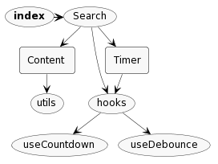

# netsearch

The demo to search my Github content with debounce, throttle, and pagination.

Using React, Typescript, [vite](https://github.com/vitejs/vite), SCSS with CSS Module, [react-query](https://github.com/TanStack/query), [Antd](https://github.com/ant-design/ant-design).

## Feature

- Enabled us to search with one keyword.  
- Search input is debounced.  
- Search request is throttled.  
- Including the pagination inside the request.  
- If there are any changes during the throttled period, it could be auto-triggered once (no more) later.  
- The cache policy could be customized as well.  

Access from the link: https://ibarapascal.github.io/netsearch/#/search

## Related info

About the Github REST API search code

- [rate limit](https://docs.github.com/en/rest/search?apiVersion=2022-11-28#rate-limit)

>For unauthenticated requests, the rate limit allows you to make up to 10 requests per minute.

- [pagination (parameters)](https://docs.github.com/en/rest/search?apiVersion=2022-11-28#search-code--parameters)

>per_page: The number of results per page (max 100).

## Visualization

- file structure

## Todos

- adjust the throttle UX maybe with masks styles  
- deploy to Github Pages  
- update the README  
- update lints  
